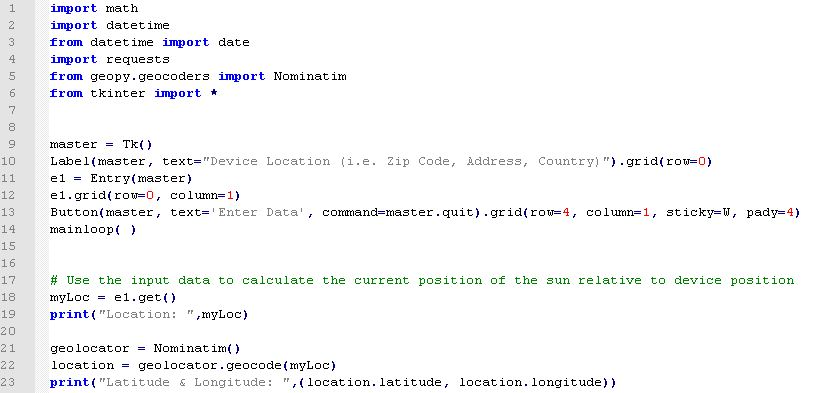

# GeoLocHelioTracker

## SUMMARY:

This Python script is intended to calculate the angle of the sun for an observer at any 
particular time of day and time of year.

The user enters their zip code or address in the simple TKinter GUI panel to begin the calculation.

The Solar Hour, Declination Angle, Solar Elevation Angle, Solar Azimuth Angle, and 
Solar Zenith Angle are then calculated. The result is returned to the user via
command terminal window.

The intent of the calculation is to allow for downstream robotics application via
Raspberry Pi or similar to control solar panel heliostats.

## DEPENDENCIES:

[1] math
[2] datetime
[3] geopy.geocoders
[4] tkinter

## FUTURE DEVELOPMENT:

Version 3 under development will request panel efficiency to calculate annual
estimated yield for N-number of panels (this is just a simple integration
beyound the current calculation).

## AUTHOR:

Brandon Coats

brandoncoats@tgautomation.tech

http://www.tgautomation.tech
